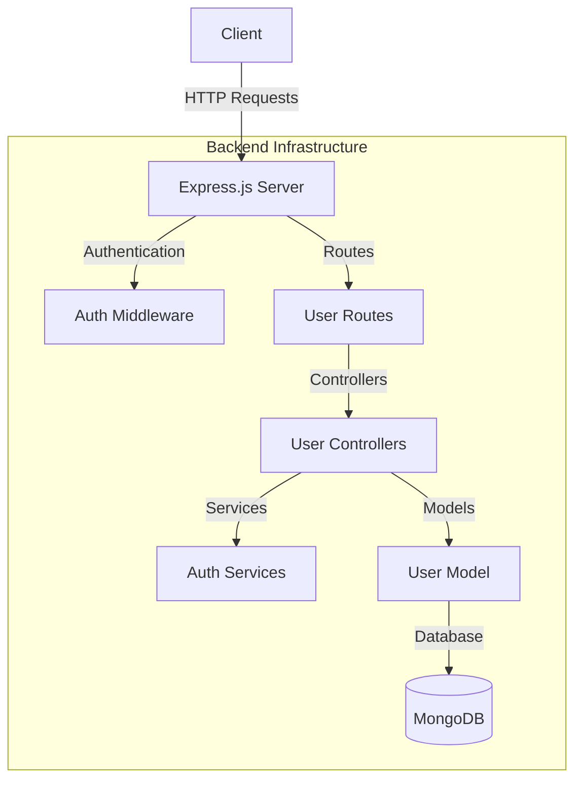
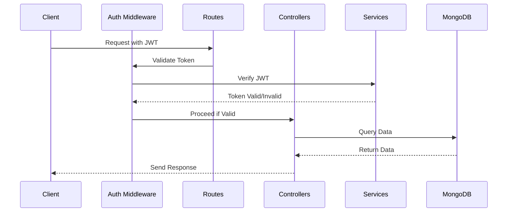
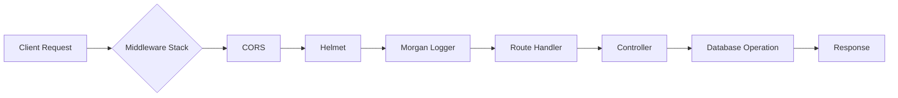

# Express MongoDB API

A robust RESTful API built with Express.js and MongoDB, featuring user authentication, input validation, and security best practices.

## 🏗 System Architecture

### Component Diagram


### Authentication Flow


### Request-Response Flow


## 🔧 Project Structure

```
express-mongo-api/
│
├── src/
│   ├── config/
│   │   └── db.js           # Database configuration
│   │
│   ├── controllers/
│   │   └── userController.js # User-related operations
│   │
│   ├── middleware/
│   │   └── authMiddleware.js # JWT authentication
│   │
│   ├── models/
│   │   └── User.js         # User schema definition
│   │
│   ├── routes/
│   │   └── userRoutes.js   # API endpoints
│   │
│   ├── services/
│   │   └── authService.js  # Authentication utilities
│   │
│   └── app.js             # Express application setup
│
├── .env                   # Environment variables
├── package.json          # Project dependencies
└── server.js            # Application entry point
```

## 🔍 Code Breakdown

### 1. Database Configuration (db.js)
```javascript
// Establishes MongoDB connection using mongoose
const connectDB = async () => {
  try {
    await mongoose.connect(process.env.MONGO_URI);
    console.log("✅ MongoDB Connected");
  } catch (error) {
    console.error("❌ MongoDB Connection Error");
    process.exit(1);
  }
};
```

### 2. User Model (User.js)
```javascript
// Defines user schema with required fields
const UserSchema = new mongoose.Schema({
  name: { type: String, required: true },
  email: { type: String, required: true, unique: true },
  password: { type: String, required: true },
}, { timestamps: true });
```

### 3. Authentication Service (authService.js)
```javascript
// Provides authentication utilities
- hashPassword(): Hashes user passwords using bcrypt
- comparePasswords(): Verifies password during login
- generateToken(): Creates JWT for authenticated sessions
```

### 4. Authentication Middleware (authMiddleware.js)
```javascript
// Protects routes by validating JWT tokens
const authenticateUser = (req, res, next) => {
  // Extracts and verifies JWT from Authorization header
  // Attaches user data to request if valid
};
```

### 5. User Controller (userController.js)
```javascript
// Handles user-related operations
- registerUser(): Creates new user accounts
- loginUser(): Authenticates users and issues JWT
- getProfile(): Retrieves user profile data
```

### 6. User Routes (userRoutes.js)
```javascript
// Defines API endpoints with validation
POST /api/users/register - New user registration
POST /api/users/login - User authentication
GET /api/users/profile - Protected profile access
```

## 🚀 API Testing Guide

### Prerequisites
- MongoDB running locally
- Node.js installed
- Updated .env file with proper configurations

### Starting the Server
```bash
# Install dependencies
npm install

# Start development server
npm run dev
```

### API Endpoints Testing

#### 1. Register User
```bash
curl -X POST http://localhost:5000/api/users/register \
  -H "Content-Type: application/json" \
  -d '{
    "name": "John Doe",
    "email": "john@example.com",
    "password": "123456"
  }'
```

Expected Response:
```json
{
  "message": "User registered successfully"
}
```

#### 2. Login User
```bash
curl -X POST http://localhost:5000/api/users/login \
  -H "Content-Type: application/json" \
  -d '{
    "email": "john@example.com",
    "password": "123456"
  }'
```

Expected Response:
```json
{
  "token": "eyJhbGciOiJIUzI1NiIs...",
  "user": {
    "id": "user_id",
    "name": "John Doe",
    "email": "john@example.com"
  }
}
```

#### 3. Get User Profile
```bash
curl -X GET http://localhost:5000/api/users/profile \
  -H "Authorization: Bearer YOUR_TOKEN_HERE"
```

Expected Response:
```json
{
  "id": "user_id",
  "name": "John Doe",
  "email": "john@example.com",
  "createdAt": "2024-03-20T10:00:00.000Z",
  "updatedAt": "2024-03-20T10:00:00.000Z"
}
```

### Error Responses

#### 1. Invalid Registration
```json
{
  "message": "User already exists"
}
```

#### 2. Invalid Login
```json
{
  "message": "Invalid credentials"
}
```

#### 3. Unauthorized Access
```json
{
  "message": "Access Denied"
}
```

## 🔒 Security Features

1. Password Hashing (bcryptjs)
2. JWT Authentication
3. HTTP Security Headers (helmet)
4. CORS Protection
5. Input Validation
6. Error Handling Middleware

## 📝 Environment Variables

```env
MONGO_URI=mongodb://127.0.0.1:27017/expressMongoDB
PORT=5000
JWT_SECRET=your_jwt_secret_key_here
```

## 🛠 Development

```bash
# Run in development mode
npm run dev

# Run in production mode
npm start
```

## 📚 API Documentation

### Swagger UI
The API documentation is available through Swagger UI at:
```
http://localhost:5000/api-docs
```

Features:
- Interactive API documentation
- Built-in API testing interface
- Authentication support with JWT
- Request/Response examples
- Schema definitions

### Using Swagger UI for Testing

1. Access the Swagger UI interface at `http://localhost:5000/api-docs`
2. Register a new user using the `/api/users/register` endpoint
3. Login using the `/api/users/login` endpoint
4. Copy the JWT token from the response
5. Click the "Authorize" button at the top of the page
6. Enter the token in the format: `Bearer <your_token>`
7. Now you can test authenticated endpoints like `/api/users/profile` 