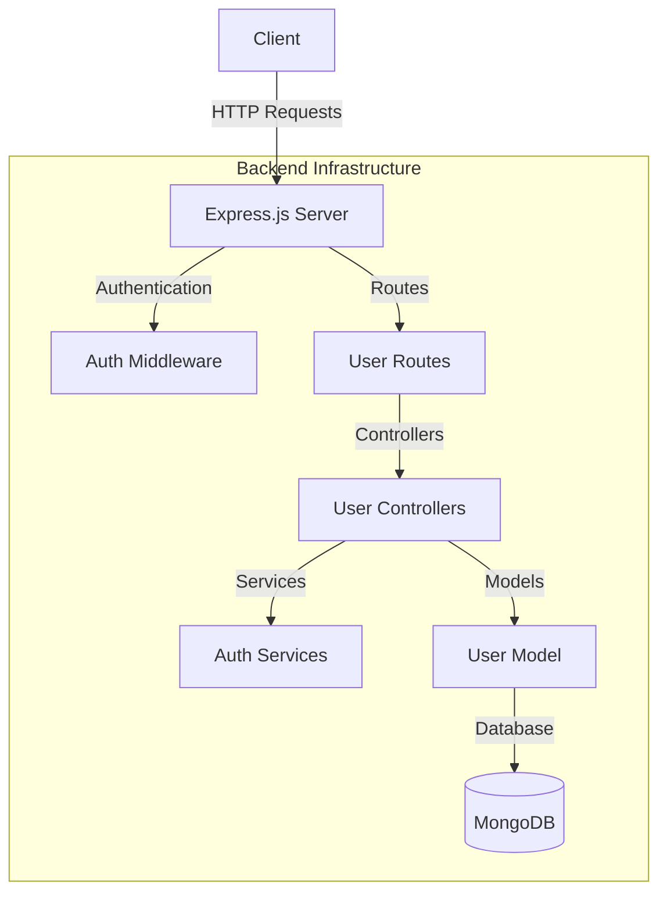
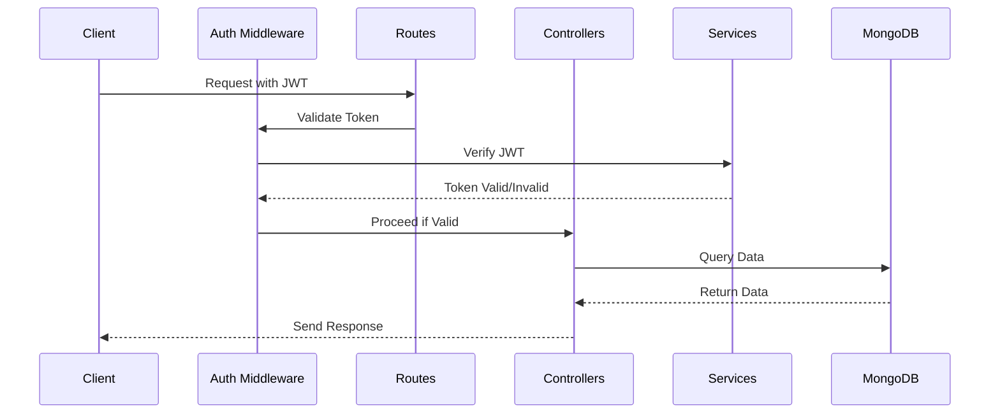
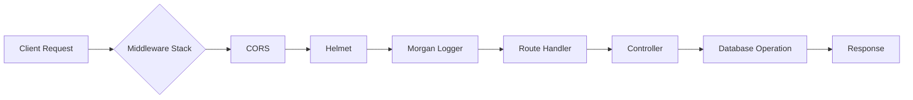

# Express MongoDB API

A comprehensive RESTful API built with Express.js and MongoDB, implementing industry-standard authentication, validation, and security practices. This API provides a robust foundation for building secure web applications with user management capabilities.

## 🏗 System Architecture

### Component Diagram


#### Detailed Component Explanation
1. **Client Layer**
   - External applications/browsers making HTTP requests
   - Communicates using JSON format
   - Handles JWT token storage and transmission

2. **Express.js Server**
   - Core application server handling requests
   - Implements middleware chain for request processing
   - Manages routing and error handling
   - Provides API endpoint implementations

3. **Authentication Layer**
   - JWT-based authentication system
   - Token verification and validation
   - Session management
   - Security middleware implementation

4. **Business Logic Layer**
   - Controllers for handling business logic
   - Services for reusable operations
   - Input validation and sanitization
   - Error handling and response formatting

5. **Data Access Layer**
   - MongoDB interaction through Mongoose ODM
   - Schema definitions and validation
   - Data persistence and retrieval
   - Index management and query optimization

### Authentication Flow


#### Detailed Authentication Process
1. **Client Request**
   - Client sends request with JWT in Authorization header
   - Token format: "Bearer <jwt_token>"
   - Includes necessary request payload

2. **Token Validation**
   - Middleware extracts token from header
   - Verifies token signature using JWT_SECRET
   - Checks token expiration
   - Validates token payload

3. **User Context**
   - Decoded user information attached to request
   - User permissions verified
   - Request forwarded to appropriate handler

4. **Response Handling**
   - Authenticated responses include user context
   - Error responses for invalid tokens
   - Proper HTTP status codes

### Request-Response Flow


#### Detailed Request Pipeline
1. **Initial Request Processing**
   ```javascript
   // Middleware Stack Implementation
   app.use(express.json()); // Parse JSON bodies
   app.use(cors());         // Handle CORS
   app.use(helmet());       // Security headers
   app.use(morgan("dev")); // Request logging
   ```

2. **Security Layer**
   ```javascript
   // CORS Configuration
   app.use(cors({
     origin: process.env.ALLOWED_ORIGINS,
     methods: ['GET', 'POST', 'PUT', 'DELETE'],
     allowedHeaders: ['Content-Type', 'Authorization']
   }));

   // Helmet Security Headers
   app.use(helmet({
     contentSecurityPolicy: true,
     xssFilter: true,
     noSniff: true,
     hidePoweredBy: true
   }));
   ```

## 🔧 Project Structure

### Detailed Directory Explanation
```
express-mongo-api/
│
├── src/                    # Source code directory
│   ├── config/            # Configuration files
│   │   ├── db.js         # Database connection setup
│   │   └── swagger.js    # API documentation config
│   │
│   ├── controllers/       # Request handlers
│   │   └── userController.js  # User operations logic
│   │
│   ├── middleware/        # Custom middleware
│   │   ├── authMiddleware.js  # JWT verification
│   │   └── errorMiddleware.js # Error handling
│   │
│   ├── models/           # Database schemas
│   │   └── User.js      # User model definition
│   │
│   ├── routes/           # API routes
│   │   └── userRoutes.js # User endpoints
│   │
│   ├── services/         # Business logic
│   │   └── authService.js # Authentication utilities
│   │
│   └── app.js           # Express application setup
│
├── .env                  # Environment configuration
├── .gitignore           # Git ignore rules
├── package.json         # Project metadata
└── server.js           # Application entry point
```

## 🔍 Detailed Code Breakdown

### 1. Database Configuration (db.js)
```javascript
const mongoose = require("mongoose");
require("dotenv").config();

const connectDB = async () => {
  try {
    // MongoDB connection with options
    await mongoose.connect(process.env.MONGO_URI, {
      useNewUrlParser: true,      // Use new URL parser
      useUnifiedTopology: true,   // Use new Server Discover and Monitoring engine
    });
    console.log("✅ MongoDB Connected");
  } catch (error) {
    console.error("❌ MongoDB Connection Error:", error);
    process.exit(1);  // Exit process with failure
  }
};

module.exports = connectDB;
```

### 2. User Model (User.js)
```javascript
const mongoose = require("mongoose");

const UserSchema = new mongoose.Schema({
  name: { 
    type: String, 
    required: [true, "Name is required"],
    trim: true,
    minlength: [2, "Name must be at least 2 characters"]
  },
  email: { 
    type: String, 
    required: [true, "Email is required"],
    unique: true,
    lowercase: true,
    match: [/^\w+([.-]?\w+)*@\w+([.-]?\w+)*(\.\w{2,3})+$/, "Please enter a valid email"]
  },
  password: { 
    type: String, 
    required: [true, "Password is required"],
    minlength: [6, "Password must be at least 6 characters"]
  }
}, { 
  timestamps: true,  // Adds createdAt and updatedAt fields
  toJSON: { 
    transform: function(doc, ret) {
      delete ret.password;  // Remove password from JSON responses
      return ret;
    }
  }
});

module.exports = mongoose.model("User", UserSchema);
```

### 3. Authentication Service (authService.js)
```javascript
const bcrypt = require("bcryptjs");
const jwt = require("jsonwebtoken");

// Password hashing with bcrypt
const hashPassword = async (password) => {
  const salt = await bcrypt.genSalt(10);  // Generate salt with 10 rounds
  return await bcrypt.hash(password, salt);
};

// Password verification
const comparePasswords = async (password, hashedPassword) => {
  return await bcrypt.compare(password, hashedPassword);
};

// JWT token generation
const generateToken = (user) => {
  return jwt.sign(
    { 
      id: user._id,
      email: user.email 
    },
    process.env.JWT_SECRET,
    { 
      expiresIn: "1h",  // Token expires in 1 hour
      algorithm: "HS256" // HMAC SHA-256 algorithm
    }
  );
};

module.exports = { hashPassword, comparePasswords, generateToken };
```

### 4. Authentication Middleware (authMiddleware.js)
```javascript
const jwt = require("jsonwebtoken");

const authenticateUser = (req, res, next) => {
  // Extract token from Authorization header
  const authHeader = req.header("Authorization");
  if (!authHeader?.startsWith("Bearer ")) {
    return res.status(401).json({ 
      message: "Access Denied", 
      error: "No token provided" 
    });
  }

  try {
    // Verify token
    const token = authHeader.split(" ")[1];
    const decoded = jwt.verify(token, process.env.JWT_SECRET);
    
    // Attach user data to request
    req.user = decoded;
    next();
  } catch (error) {
    res.status(401).json({ 
      message: "Invalid Token",
      error: error.message 
    });
  }
};

module.exports = authenticateUser;
```

### 5. User Controller (userController.js)
```javascript
// Handles user-related operations
- registerUser(): Creates new user accounts
- loginUser(): Authenticates users and issues JWT
- getProfile(): Retrieves user profile data
```

### 6. User Routes (userRoutes.js)
```javascript
// Defines API endpoints with validation
POST /api/users/register - New user registration
POST /api/users/login - User authentication
GET /api/users/profile - Protected profile access
```

## 🚀 API Testing Guide

### Prerequisites
- MongoDB running locally
- Node.js installed
- Updated .env file with proper configurations

### Starting the Server
```bash
# Install dependencies
npm install

# Start development server
npm run dev
```

### API Endpoints Testing

#### 1. Register User
```bash
curl -X POST http://localhost:5000/api/users/register \
  -H "Content-Type: application/json" \
  -d '{
    "name": "John Doe",
    "email": "john@example.com",
    "password": "123456"
  }'
```

Expected Response:
```json
{
  "message": "User registered successfully"
}
```

#### 2. Login User
```bash
curl -X POST http://localhost:5000/api/users/login \
  -H "Content-Type: application/json" \
  -d '{
    "email": "john@example.com",
    "password": "123456"
  }'
```

Expected Response:
```json
{
  "token": "eyJhbGciOiJIUzI1NiIs...",
  "user": {
    "id": "user_id",
    "name": "John Doe",
    "email": "john@example.com"
  }
}
```

#### 3. Get User Profile
```bash
curl -X GET http://localhost:5000/api/users/profile \
  -H "Authorization: Bearer YOUR_TOKEN_HERE"
```

Expected Response:
```json
{
  "id": "user_id",
  "name": "John Doe",
  "email": "john@example.com",
  "createdAt": "2024-03-20T10:00:00.000Z",
  "updatedAt": "2024-03-20T10:00:00.000Z"
}
```

### Error Responses

#### 1. Invalid Registration
```json
{
  "message": "User already exists"
}
```

#### 2. Invalid Login
```json
{
  "message": "Invalid credentials"
}
```

#### 3. Unauthorized Access
```json
{
  "message": "Access Denied"
}
```

## 🔒 Security Features

1. **Password Security**
   - Bcrypt hashing with salt rounds
   - Password strength validation
   - Secure password reset flow

2. **JWT Implementation**
   - Token-based authentication
   - Secure token generation
   - Expiration handling
   - Token refresh mechanism

3. **HTTP Security (Helmet)**
   - XSS protection
   - Content Security Policy
   - MIME sniffing prevention
   - Frame protection
   - DNS prefetch control

4. **CORS Protection**
   - Origin validation
   - Method restrictions
   - Header allowlist
   - Credential handling

5. **Input Validation**
   - Request body validation
   - Parameter sanitization
   - Type checking
   - Size limits

6. **Error Handling**
   - Centralized error handling
   - Detailed error logging
   - Safe error responses
   - Rate limiting

## 📝 Environment Variables

```env
MONGO_URI=mongodb://127.0.0.1:27017/expressMongoDB
PORT=5000
JWT_SECRET=your_jwt_secret_key_here
```

## 🛠 Development

```bash
# Run in development mode
npm run dev

# Run in production mode
npm start
```

## 📚 API Documentation

### Swagger UI
The API documentation is available through Swagger UI at:
```
http://localhost:5000/api-docs
```

Features:
- Interactive API documentation
- Built-in API testing interface
- Authentication support with JWT
- Request/Response examples
- Schema definitions

### Using Swagger UI for Testing

1. Access the Swagger UI interface at `http://localhost:5000/api-docs`
2. Register a new user using the `/api/users/register` endpoint
3. Login using the `/api/users/login` endpoint
4. Copy the JWT token from the response
5. Click the "Authorize" button at the top of the page
6. Enter the token in the format: `Bearer <your_token>`
7. Now you can test authenticated endpoints like `/api/users/profile` # express
